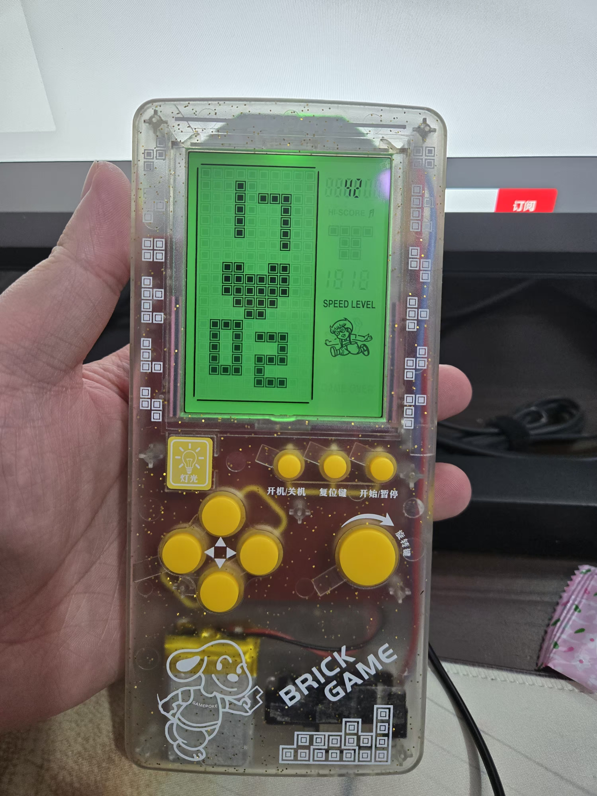
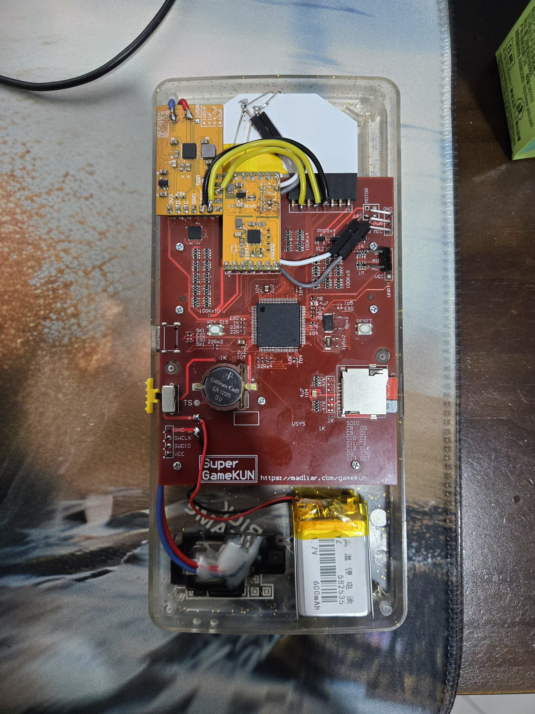

# GameKunV1
Magic Revised Tetris Palm

### 简介

这是一款魔改版的俄罗斯方块掌机，移除了原主板，换上了自制主板。自制主板选用高性能的 stm32H7 作为主控，通过电阻分压网络驱动液晶屏，还添加了 TAS2563 音频功放芯片来驱动扬声器，实现了声色俱全的效果，支持编写自制游戏。

This is a modified version of the Tetris handheld game console. The original motherboard has been removed and replaced with a self - made one. The self - made motherboard uses the high - performance STM32H7 as the main control unit. It drives the liquid crystal display through a resistor voltage - dividing network. Additionally, a TAS2563 audio power amplifier chip is added to drive the speaker, achieving a full - fledged audio - visual effect. It also supports the development of self - made games.

图纸有几处错误：
1. 音频功放的部分使用SAI接口，但若使用H723芯片，则该接口对应的SAI模块不支持半传输DMA中断，因此使用跳线连接到I2S1接口；
2. 原本预留了一个ADC通道，用于连接模拟麦克风，但若使用H723芯片，对应通道不支持半传输中断；
3. 主板上集成一颗MPU6050传感器，但电路绘制错误，芯片焊上不可用；
3. 没有兼容原机的电池座

