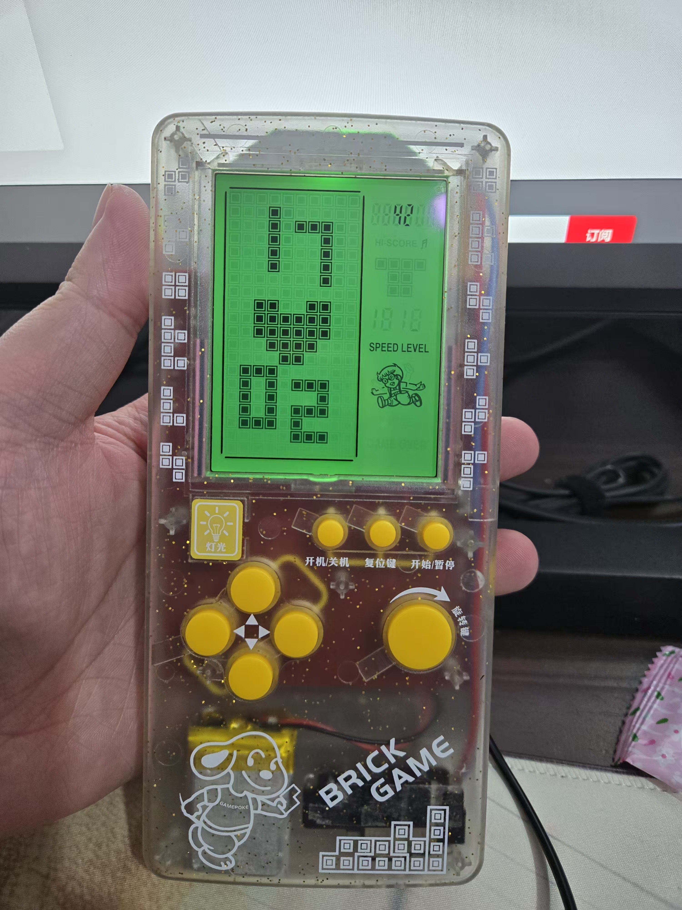

1. 开/关机

推动右侧开关，自动进入开机模式，展示时钟。时钟会自动同步网络时间，保持精准。

2. 连接网络

用Type-C数据线连接电脑，然后按住“开始/暂停键”，直到屏幕显示USB图标，此时电脑上会多出一个大容量存储的设备。此过程可能较为漫长，需耐心等待。

打开大容量存储设备，根目录下会有一个“wifi.txt”文件（若没有，就自行创建），文件名区分大小写。在这个文件内写入WiFi的名称（ssid）和密码，用“*”相隔。注意WiFi名不可以包含英文星号“*”。

例如，WiFi名为“madliar”，密码为“password”，则在文件内写入“madliar*password”。又如，WiFi名称为“madliar”，密码为“1234*abc”，则在文件内写入“madliar*1234*abc”。

保存之后，按住“开始/暂停键”，退出USB模式后，重新开关机，即可以自动联网获取时间。

在首次开机时，系统会自动同步网络时间，此后每间隔2小时同步一次。同步成功时，设备后部顶端的LED灯会闪烁。

3. 手动调整时间

在时钟模式下，长按“复位键”，小时数会闪烁。此时按上、下键调整数字。再短按复位键，分钟数开始闪烁，按照同样的方法调整分钟，再按复位键，会退回到时钟模式。

4. MP3功能

时钟模式下，按住“旋转键”会进入音乐播放器模式。此时上下键调整音量，左右键切换歌曲，旋转键控制播放、暂停。再次长按旋转键，系统退出MP3播放器。

使用2中链接到电脑的方式，可以从电脑上下载音乐到设备中，但需注意，此设备仅支持wav格式，码率为44.1Khz或48Khz。
